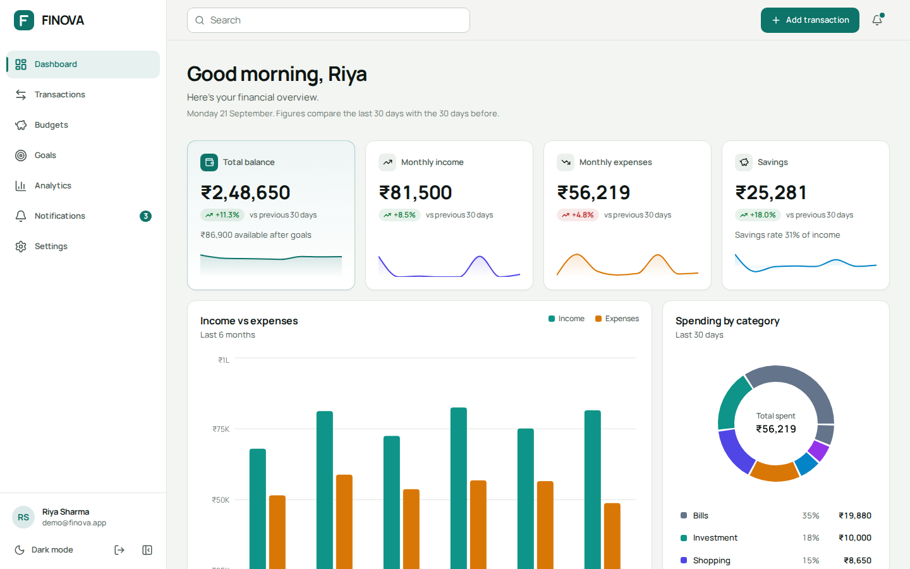
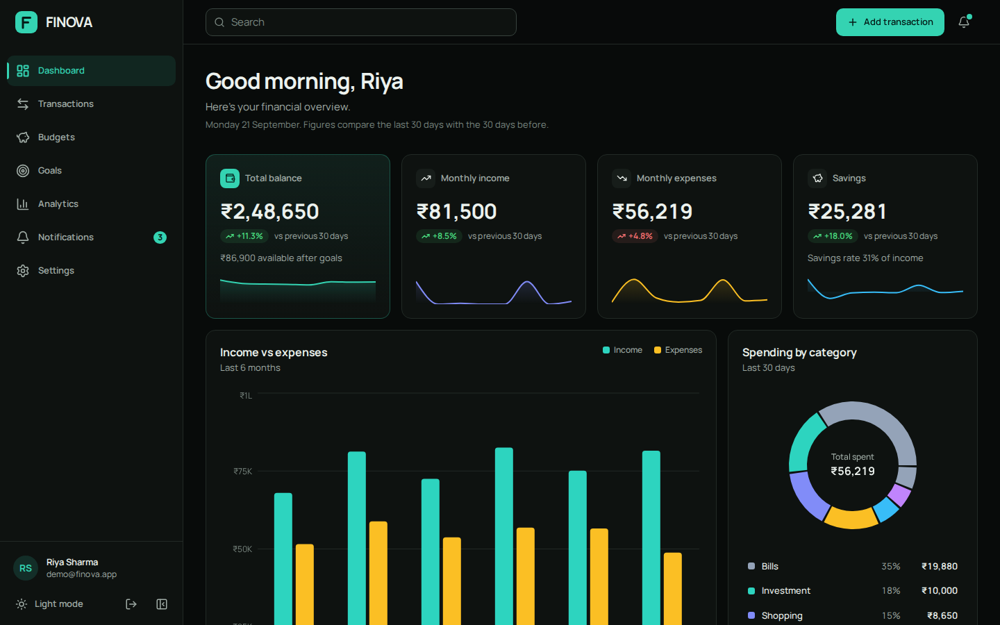
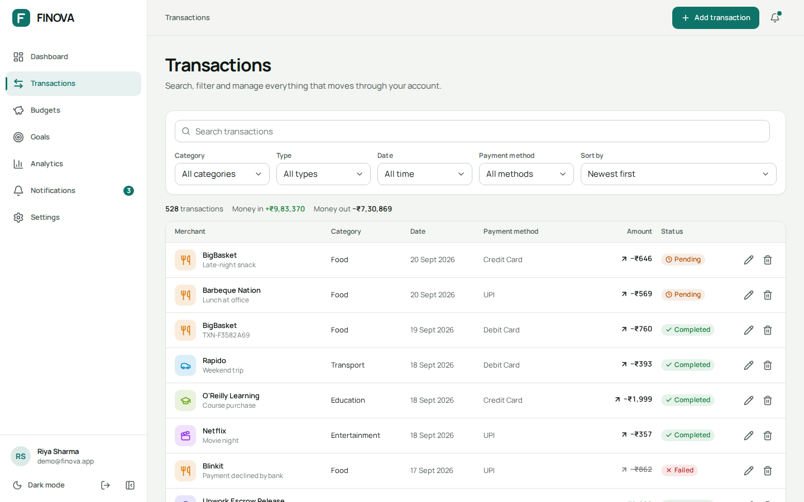
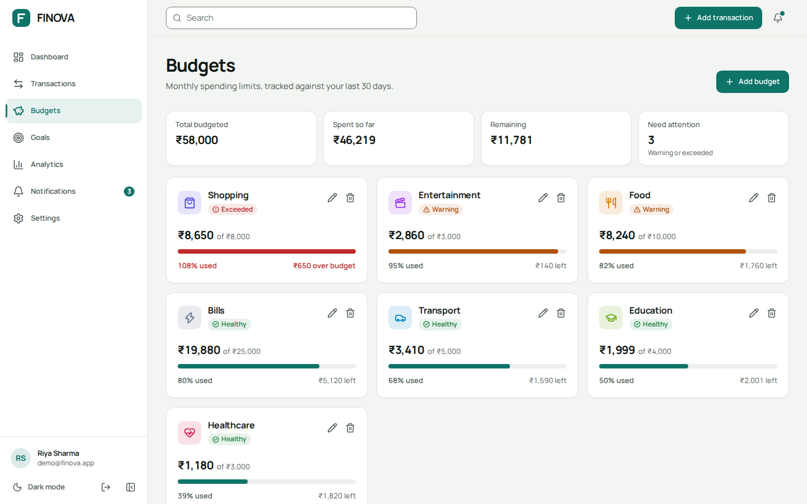
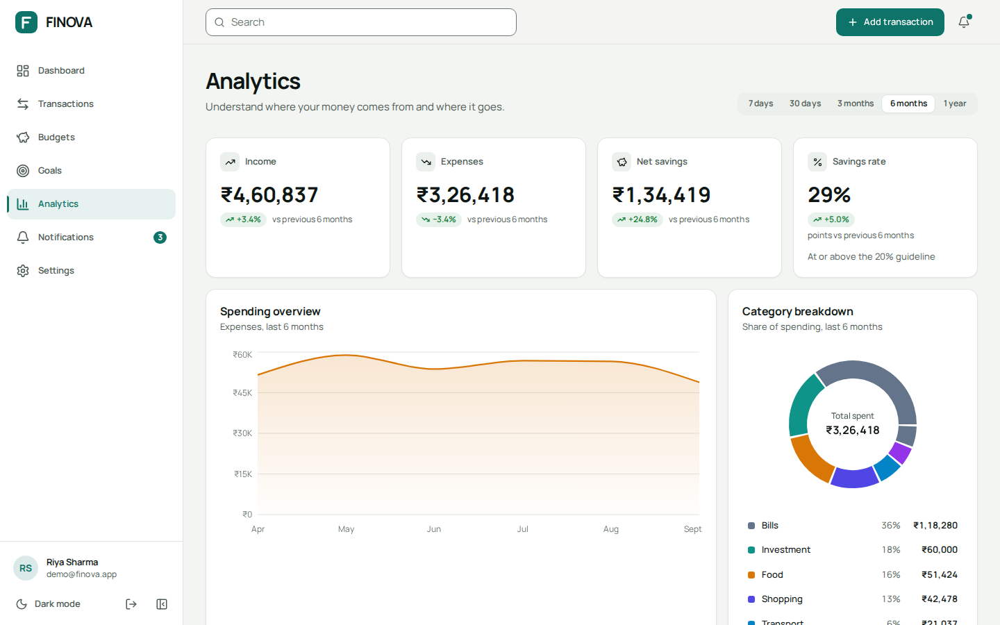

# FINOVA

A personal finance dashboard for tracking income, expenses, budgets and savings goals, with an animation system built on GSAP.

FINOVA is a front-end project. There is no server: a mock API layer talks to `localStorage`, so every feature (auth, CRUD, analytics, notifications) works offline and the data never leaves your browser.

**Demo account:** `demo@finova.app` / `Finova@123` (or use the "Explore with the demo account" button on the login page).

## Screenshots

| Dashboard | Dashboard (dark) |
| --- | --- |
|  |  |

| Transactions | Budgets |
| --- | --- |
|  |  |



## Features

- **Dashboard**: balance, income, expenses and savings with change vs the previous 30 days, income-vs-expense chart, category donut, spending trend with a 7-day average, recent transactions, budget and goal overviews, quick actions (including CSV export).
- **Transactions**: search, filter by category / type / payment method / date range (presets or custom), sort, pagination, add / edit / delete with confirmation, and a detail page per transaction. Filters live in the URL, so a filtered view can be shared or refreshed.
- **Budgets**: per-category limits on a rolling 30-day window with healthy / warning / exceeded states.
- **Goals**: targets with deadlines, "add money" flow that checks your available balance, milestone notifications, suggested monthly saving.
- **Analytics**: five time ranges (7 days to 1 year), spending / income / savings-rate charts, category breakdown, top categories with change vs the previous period, and a financial health score built from four indicators.
- **Notifications**: budget warnings, payments, goal milestones and large transactions, with read / unread state.
- **Profile and settings**: avatar upload (resized client-side), profile editing, password change, notification preferences, currency and language, theme (light / dark / system), reduce-motion switch.
- **Auth**: signup, login, "remember me", protected routes that return you to where you were headed.
- **Indian number formatting** (₹2,48,650, compact `L` / `Cr` labels on charts) with INR, USD, EUR and GBP display options.

Every list and chart has loading, empty and error states. New accounts start empty; a dashboard button loads the sample dataset.

## Tech stack

| Area | Choice |
| --- | --- |
| UI | React 19, JavaScript (no TypeScript) |
| Build | Vite 8 |
| Styling | Tailwind CSS 3.4 with CSS-variable design tokens |
| Animation | GSAP 3 with `@gsap/react` (`useGSAP`) and ScrollTrigger |
| Routing | React Router 7 |
| Charts | Recharts 2 |
| Icons | Lucide React |
| Font | Manrope Variable (self-hosted via Fontsource) |
| Quality | ESLint 10 with `react-hooks` and `react-refresh` rules |

## Getting started

Requirements: Node 20.19+ or 22.12+ (Vite 8 requirement).

```bash
npm install
npm run dev        # http://localhost:5173
npm run build      # production build in dist/
npm run preview    # serve the production build
npm run lint       # ESLint, must report zero problems
```

No environment variables or API keys are needed.

### Deploying

It is a static site (`npm run build`, publish `dist/`). Because routing is client-side, the host must serve `index.html` for every path; `vercel.json` and `public/_redirects` (Netlify) already do that.

## Routes

| Path | Access | Page |
| --- | --- | --- |
| `/` | any | redirects to `/dashboard` |
| `/login`, `/signup` | signed out only | authentication |
| `/dashboard` | signed in | overview |
| `/transactions` | signed in | list, filters, pagination |
| `/transactions/:id` | signed in | transaction detail |
| `/budgets` | signed in | budgets |
| `/goals` | signed in | goals |
| `/analytics` | signed in | analytics |
| `/notifications` | signed in | notification centre |
| `/profile` | signed in | profile |
| `/settings` | signed in | settings |
| anything else | signed in | 404 inside the app shell |

Pages are lazy-loaded (`src/routes/pages.js`) and preloaded in the background after sign-in.

## Architecture

The code is layered so that each layer only talks to the one below it:

```
pages  ->  components  ->  hooks / context  ->  services  ->  db (localStorage)
                                   ^
                          utils (pure functions: formatting, finance maths, validation)
```

- **`utils/`** holds pure, framework-free functions: `finance.js` (totals, budget usage, goal progress, analytics, health score), `format.js` (money, dates, percentages), `validators.js`, `transactions.js` (filter / sort / paginate).
- **`services/`** is the only code that knows data lives in `localStorage`. Components never import it directly, except `AnalyticsPage`, which calls `getAnalytics`.
- **`context/`** providers cache server data and expose actions. Components read them through `hooks/useContexts.js`.
- **`components/`** are grouped by feature (`transactions`, `budgets`, `goals`, ...) plus shared `ui`, `forms`, `charts`, `layout`.

### Project structure

```
src/
  components/   feature folders + ui, forms, charts, layout, navigation
  context/      Auth, Theme, Settings, Finance, Notification, Toast, UI providers
  data/         seeded, deterministic sample data generators
  hooks/        shared hooks (formatters, debounce, filters, dialog behaviour, ...)
  motion/       GSAP setup, tokens, hooks, AnimatedNumber, PageTransition, overlay motion
  pages/        one file per route
  routes/       route table, guards, lazy page loaders
  services/     mock API: api.js, authService, financeService, notificationService, db
  styles/       Tailwind layers and design tokens (index.css)
  utils/        pure helpers
scripts/        optional Playwright test scripts (see Testing)
```

### State management

React Context with reducers, split by concern so unrelated updates do not re-render each other:

- `AuthProvider`: current user; `login` is split into `authenticate` and `activate` so the form can show a success state before the route changes.
- `ThemeProvider`: light / dark / system, applied to `<html>`; a small script in `index.html` sets the theme before first paint to avoid a flash.
- `SettingsProvider`: per-user preferences (currency, language, alerts).
- `FinanceProvider`: transactions, budgets, goals and dashboard stats in a `useReducer` store. Every mutation calls the service, then refreshes the cache, so the dashboard, budgets and goals never disagree. It also raises notifications when a budget crosses a threshold, a large transaction is recorded or a goal hits a milestone.
- `NotificationProvider`, `ToastProvider`, `UIProvider` (modal state, sidebar, mobile menu).

### Mock API and backend readiness

`services/api.js` wraps every call in `respond()`, which simulates latency and (optionally) failures. Service functions validate input and throw `ApiError` with an HTTP-style status, just as a real client would.

Turning this into a real integration means rewriting the service functions to use `fetch` and deleting `db.js`. Components, providers and pages do not change. Suggested mapping:

| Service function | Endpoint |
| --- | --- |
| `getTransactions`, `createTransaction`, `updateTransaction`, `deleteTransaction` | `/transactions` |
| `getBudgets`, `createBudget`, ... | `/budgets` |
| `getGoals`, `addMoneyToGoal`, ... | `/goals`, `/goals/:id/contributions` |
| `getDashboardStats`, `getAnalytics(range)` | `/dashboard`, `/analytics?range=` |
| `login`, `signup`, `logout` | `/auth/*` |

Things a real backend must take over: password handling (the demo hashes with SHA-256 in the browser, which is **not** real security), sessions (the demo stores a token in `localStorage` / `sessionStorage`), and the currency rates (fixed demo values in `utils/constants.js`).

## Animation system

All GSAP code lives in `src/motion` or in components that use `useGSAP` with a `scope`, so every animation is cleaned up on unmount. GSAP is registered once in `motion/gsap.js`; nothing else imports it directly. Easing and durations come from `motion/tokens.js`.

| Where | What |
| --- | --- |
| Page header | title, description, meta and actions enter as one timeline |
| Stat cards | staggered rise on load, animated number counters, hover lift |
| Charts | card rises on scroll (ScrollTrigger), then a left-to-right wipe (or a scale for donuts); hover markers pop in |
| Progress bars | fill from 0 on first view, tween on change, one halo pulse when a budget is exceeded |
| Sidebar | width animates between expanded and collapsed; the active-item indicator glides between items |
| Mobile menu, modals | one timeline: overlay fade, panel slide or scale, content stagger; closing plays it in reverse |
| Transactions table | rows stagger in when filters, sort or page change; a new row slides in; a deleted row fades and collapses before removal |
| Toasts | enter and exit tweens with an auto-dismiss timer |
| Route changes | short exit and enter transition (about 450 ms total) |
| Buttons | scale, press feedback, icon nudge and a sheen on primary buttons |
| Theme switch | crossfade of colours, icon spin |

### Reduced motion

Motion is skipped when the operating system asks for reduced motion, or when "Reduce motion" is switched on in Settings (which adds `html.reduce-motion`). Animations check `prefersReducedMotion()` before running, counters jump straight to their final value, and a CSS rule shortens any remaining transitions.

## Design notes

- Colours are CSS custom properties (RGB triplets) consumed through Tailwind, so light and dark themes share one set of utility classes. The categorical chart palette is `--chart-1` to `--chart-8`.
- Income and expense are never distinguished by colour alone: amounts carry a sign and an arrow icon, and status badges carry an icon and a label.
- Charts have text summaries (`role="img"` with a label), HTML legends, and tooltips.
- Dialogs trap focus, restore it on close, close on Escape and lock page scroll; there is a skip-to-content link and every icon-only button has an accessible name.

## Data and privacy

Everything is stored in your browser under keys prefixed `finova:` (per-user data under `u:<userId>:`). "Clear all data" and "Restore demo data" are in Settings, Account. Nothing is sent anywhere.

The sample data is generated from a fixed seed (`data/transactions.js`), so the demo looks the same every time. Dates are relative to today.

## Testing

There is no unit-test suite yet. Two optional end-to-end scripts drive the built app in Chromium using Playwright for Python:

```bash
pip install playwright && playwright install chromium
npm run build && npm run preview -- --port 4173      # in one terminal
python3 scripts/flows.py                              # CRUD, auth, filters, settings, theme (31 steps)
python3 scripts/smoke.py 1440 900 light               # visit every route, save screenshots, report overflow and console errors
```

Other scripts: `mobile.py` captures phone-sized shots of the drawer, modal and filters, and `reduced.py` checks that content appears immediately and nothing stays hidden when the OS asks for reduced motion.

Arguments for `smoke.py` are viewport width, height and colour scheme. Screenshots go to `/home/claude/shots` by default; change `OUT` in the scripts.

## Possible next steps

- Unit tests for `utils/finance.js` and `utils/transactions.js` (they are pure and easy to test).
- A real backend behind the service layer (see the mapping above), with proper authentication.
- Recurring transactions and bill reminders.
- Receipt attachments on transactions.
- CSV import, and PDF statements.
- Multi-currency accounts with live exchange rates.
- Keyboard shortcuts (for example `n` to add a transaction).
- A cross-browser test run (the scripts here were only run in Chromium).
